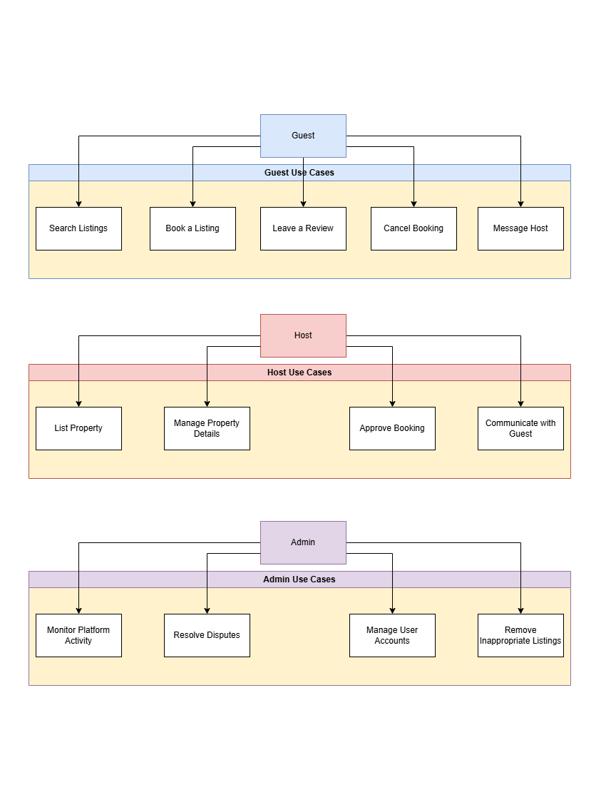

# Requirement Analysis in Software Development

## Introduction

This repository is dedicated to exploring the critical process of requirement analysis in software development. It aims to provide insights, methods, and tools used for gathering, analyzing, and documenting requirements to ensure the successful delivery of software projects.

## What is Requirement Analysis?

Requirement analysis is a fundamental step in the software development lifecycle (SDLC) that focuses on identifying, gathering, and defining the needs and expectations of stakeholders for a software system. This process ensures that the development team has a clear understanding of what the system is supposed to accomplish and provides a foundation for subsequent stages of development.

### Importance in SDLC

1. **Clarity and Direction:** Requirement analysis helps in clearly defining the goals and scope of the project, avoiding ambiguity and misunderstandings.

2. **Alignment with Stakeholders:** It ensures that the final product aligns with the expectations and objectives of stakeholders, including clients, end-users, and development teams.

3. **Improved Planning:** By identifying requirements early, teams can estimate timelines, resources, and budgets more accurately.

4. **Risk Mitigation:** Thorough requirement analysis helps in identifying potential challenges or risks early in the process, reducing the likelihood of costly changes later.

5. **Foundation for Design and Development:** Requirements serve as a blueprint for designing system architecture, user interfaces, and functionalities.

6. **Validation and Testing:** Clear requirements facilitate the creation of test cases to validate that the software meets stakeholder expectations.

## Why is Requirement Analysis Important?

1. **Ensures Project Success:** A well-conducted requirement analysis increases the likelihood of project success by clearly defining the scope and objectives, reducing the chances of project failure.

2. **Minimizes Rework:** Identifying and addressing requirements early in the SDLC prevents costly changes and rework during later stages of development.

3. **Enhances Communication:** It serves as a bridge between stakeholders and the development team, ensuring all parties are aligned and understand the project goals and constraints.

## Key Activities in Requirement Analysis

- **Requirement Gathering:**
  Collecting information from stakeholders, users, and other relevant sources to understand their needs and expectations for the software system.

- **Requirement Elicitation:**
  Actively engaging with stakeholders through techniques like interviews, workshops, and surveys to uncover implicit and explicit requirements.

- **Requirement Documentation:**
  Organizing and recording the gathered requirements in a clear and structured format, such as Software Requirement Specifications (SRS), to ensure all stakeholders have a shared understanding.

- **Requirement Analysis and Modeling:**
  Evaluating the requirements to ensure they are feasible, consistent, and aligned with project objectives. This may involve creating visual models like use-case diagrams or process flows.

- **Requirement Validation:**
  Reviewing and verifying requirements with stakeholders to confirm that they accurately represent their needs and are achievable within the project’s constraints.

## Types of Requirements

### Functional Requirements

Functional requirements define the specific behaviors, features, or functions of a system. These requirements describe what the system should do to fulfill user and business needs.

#### Examples for Booking Management Project:

- Users should be able to search for available hotels by location, date, and number of guests using Elasticsearch for efficient query handling.
- The system should allow users to create, update, and cancel bookings, with Redis used to cache booking data for faster processing.
- Payment integration should support multiple payment methods through a third-party payment service.
- Users should receive booking confirmation via email or SMS, utilizing a messaging queue system like Kafka for real-time notification delivery.
- Administrators should have a separate portal to manage hotel listings and related information via the Hotel Management Service.
- Hotel managers should be able to update their property details, which will sync to the database and CDN for real-time availability.

### Non-functional Requirements

Non-functional requirements specify the quality attributes, performance, and constraints of the system. These requirements describe how the system performs its functions, rather than the specific functions themselves.

#### Examples for Booking Management Project:

- The system should handle up to 10,000 concurrent users without performance degradation, distributing requests through load balancers.
- Booking confirmation emails and notifications should be delivered within 30 seconds of payment completion via Kafka consumers.
- The application should have a 99.9% uptime guarantee, leveraging a microservice architecture with failover mechanisms.
- Data encryption should be implemented during transmission and storage, and sensitive data should comply with security standards such as GDPR.
- The user interface should load within 2 seconds on standard internet connections, utilizing a CDN to reduce latency and improve content delivery.
- Historical data should be archived in a scalable NoSQL database like Cassandra for efficient storage and retrieval as data size grows.

## Use Case Diagrams

Use Case Diagrams are a visual representation of the interactions between users (actors) and the system to achieve a specific goal. These diagrams help identify the functional requirements of a system and how various users interact with it.

### Benefits of Use Case Diagrams

- **Clarity in Requirements:** Use Case Diagrams provide a clear and concise view of the system's functionalities and how users interact with it.
- **Improved Communication:** They serve as a common language between stakeholders and developers, ensuring a shared understanding of the system.
- **Facilitates Design and Development:** By identifying the key interactions, Use Case Diagrams help in designing the system architecture and workflows.
- **Simplified Testing:** They assist in creating test cases by outlining specific user interactions and scenarios.

## Acceptance Criteria

Acceptance criteria are a set of predefined requirements that must be met for a feature or system to be considered complete and acceptable by stakeholders. These criteria ensure that the development team delivers exactly what the stakeholders expect.

### Importance in Requirement Analysis

- **Clarity:** Acceptance criteria provide a clear understanding of what is expected, reducing ambiguity.
- **Alignment:** They align the development team's work with stakeholder expectations.
- **Validation:** They serve as a benchmark to verify that the developed feature meets the requirements.
- **Efficient Testing:** Acceptance criteria guide the creation of test cases to ensure thorough validation.

### Example: Checkout Feature in Booking Management System

**Acceptance Criteria:**

1. Users must be able to review the selected hotel details, including name, location, dates, and price, before confirming the booking.
2. Users should be able to enter payment information, including card details or alternative payment methods.
3. The system should validate payment details and display appropriate error messages if invalid.
4. Upon successful payment, the booking confirmation screen should display a unique booking ID and a summary of the booking.
5. A booking confirmation email or SMS should be sent to the user within 30 seconds.
6. The booking record must be saved in the database and cached in Redis for immediate access.

